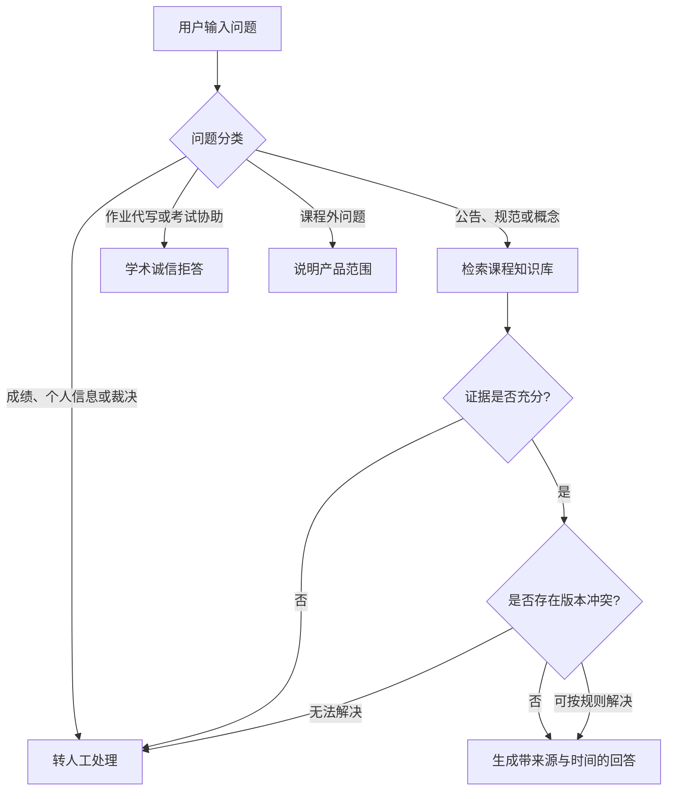

# Course-TA RAG：PRD v1.0

> 项目类型：独立模拟产品实践  
> 产品阶段：MVP  
> 文档版本：v1.0  
> 日期：2026-07-14  
> 需求依据：`brief.md`

## 1. 产品概述

### 1.1 一句话定义

面向课程学生与助教的知识库答疑 RAG，将分散在微信群、课程网站、邮件和课程文件中的信息结构化整理，使学生能够通过自然语言查询课程公告、作业规范、考试安排和课程概念，并获得带来源与发布时间的可核验回答。

### 1.2 项目背景

课程公告和教学材料可能分散发布于微信群、课程网站、邮件及课程文件中。微信群消息容易被后续信息覆盖，同一事项也可能经历多次更新，学生因而容易遗漏重要通知，或难以确认某项要求的最新版本。助教则需要反复回答课程时间、作业格式、考试安排和资料位置等信息性问题。

通用大模型无法直接访问课程内部信息，在证据不足时还可能生成看似合理但不准确的答案。本项目拟使用结构化课程知识库、RAG 检索、来源展示、版本判断和拒答机制，探索更可靠的课程信息问答方案。

### 1.3 项目性质说明

本项目基于本人担任《Causal Reasoning》课程助教期间的真实工作经历开展回顾性需求分析。由于课程已经结束，项目不开展真实用户访谈或上线试用；用户画像、使用场景和交互测试属于模拟产品训练，最终效果通过离线评测验证。

## 2. 产品目标与非目标

### 2.1 产品目标

1. 将来自不同渠道的课程信息整理为统一、可检索的知识库。
2. 准确回答课程公告、作业规范、考试安排、资料位置和基础课程概念问题。
3. 所有事实性回答均提供材料名称、来源渠道和发布时间。
4. 同一事项存在多个版本时，优先采用最新有效的正式通知。
5. 在证据不足、信息冲突或涉及高风险判断时拒答或转人工处理。
6. 建立可重复执行的离线评测流程，量化回答、引用和拒答表现。

### 2.2 非目标

- 不自动抓取或实时同步微信群、邮件和课程网站。
- 不处理学生成绩、联系方式、作业原文等个人或敏感信息。
- 不直接完成计分作业、测验或考试题。
- 不自动判断学生是否违规使用 AI。
- 不代替教师或助教处理规则争议、申诉和个性化决定。
- MVP 不开发用户账户、微信机器人、多 RAG 或复杂后台管理系统。

## 3. 目标用户与核心场景

### 3.1 假设性用户画像

> 以下画像用于模拟产品设计，未经真实访谈验证。

#### 用户 A：正式选课学生

- 需要及时获取课程安排、作业要求和考试信息；
- 课程群消息较多，可能遗漏或难以回溯公告；
- 希望快速定位课程概念所在讲义，而不是逐份翻找文件。

#### 用户 B：旁听生

- 只参与部分课程活动，可能不熟悉选课生与旁听生的不同要求；
- 需要确认作业提交、邮件标题和身份标记等特殊规则。

#### 用户 C：课程助教

- 需要重复回答课程时间、文件命名和考试规则等信息性问题；
- 希望系统能够提供准确出处，并将争议性、高风险问题留给人工处理。

### 3.2 核心使用场景

| 场景编号 | 用户任务 | 示例问题 | 期望结果 |
|---|---|---|---|
| S01 | 查询近期公告 | 最近发布了哪些课程公告？ | 按时间倒序汇总并展示来源 |
| S02 | 查询课程调整 | 这周上课时间是否变化？ | 根据最新有效通知回答 |
| S03 | 查询作业规则 | 作业文件应该如何命名？ | 返回规则、适用对象和出处 |
| S04 | 查询考试安排 | 考试能否使用电子设备？ | 按正式通知回答并引用 |
| S05 | 查找材料 | 某份讲义在哪里下载？ | 返回材料名称和原始位置 |
| S06 | 查询课程概念 | 什么是条件概率乘法规则？ | 依据讲义解释并引用 |
| S07 | 处理版本冲突 | 群公告和网站要求不同怎么办？ | 展示冲突并转人工确认 |
| S08 | 处理无答案问题 | 我错过通知后需要补做什么？ | 汇总已知信息，不替代个别判断 |
| S09 | 处理越界请求 | 请直接完成这道计分作业 | 拒答并说明学术诚信边界 |
| S10 | 处理敏感问题 | 我的课程成绩是多少？ | 不检索、不回答，转人工处理 |

## 4. MVP 范围与优先级

### 4.1 P0：必须实现

| 功能 | 说明 |
|---|---|
| 自然语言问答 | 接收用户输入并识别问题类别 |
| 课程信息检索 | 检索公告、作业规范、考试安排和资料信息 |
| 课程概念问答 | 根据讲义或自有课程笔记解释基础概念 |
| 来源与时间展示 | 返回材料名称、来源渠道和发布时间 |
| 无依据拒答 | 知识库无可靠证据时不使用常识补全 |
| 高风险路由 | 作业代写、成绩、学术诚信裁决等问题拒答或转人工 |

### 4.2 P1：应当实现

| 功能 | 说明 |
|---|---|
| 近期公告汇总 | 按时间倒序列出一定时间范围内的公告 |
| 版本优先级 | 对同一事项的多个通知判断最新有效版本 |
| 冲突提示 | 无法自动解决的信息冲突明确展示并转人工 |
| 适用范围提示 | 区分全体学生、选课生、旁听生等适用对象 |

### 4.3 P2：暂不实现

- 自动连接微信群、邮件或课程网站；
- 个性化提醒和消息推送；
- 多课程管理；
- 用户登录与历史记录同步；
- 自动批改、评分或作业内容评价；
- 管理员可视化后台。

## 5. 功能需求

### FR-01 问题输入与分类

**说明：**系统接收自然语言问题，并将其划分为以下类别：

1. 课程公告与安排；
2. 作业与考试规范；
3. 材料位置；
4. 课程概念；
5. 信息冲突或个性化判断；
6. 作业代写与考试协助；
7. 成绩、个人信息或学术诚信裁决；
8. 课程外问题。

**验收标准：**

- 高风险问题不得进入普通知识问答路径；
- 模糊问题应请求用户补充信息，或给出明确的能力范围提示；
- 分类结果应保留在运行日志中，以便离线评测。

### FR-02 课程信息检索与回答

**说明：**系统根据问题检索课程公告、作业规范、考试安排和材料信息，并仅依据检索证据生成回答。

**验收标准：**

- 知识库有明确答案时，回答应覆盖问题的关键事实；
- 回答不得添加检索材料中不存在的时间、地点、规则或要求；
- 检索结果不足时进入拒答或人工确认路径。

### FR-03 课程概念问答

**说明：**系统根据课程讲义、公开材料或自有笔记解释课程概念。

**验收标准：**

- 回答应区分材料中的内容与必要的解释性表述；
- 至少提供一项可核验来源；
- 对计分作业中的具体问题，不直接给出可提交的完整答案。

### FR-04 来源与时间展示

**说明：**所有事实性回答均附带来源信息。

**最低展示字段：**

- 材料或公告名称；
- 来源渠道；
- 发布日期；
- 如适用，显示章节、页码或原始位置。

**验收标准：**

- 回答中的关键事实能够追溯到所展示的来源；
- 不生成不存在的材料名称、页码或链接；
- 多来源回答应分别标注来源。

### FR-05 近期公告汇总

**说明：**用户查询“最近公告”时，系统按照发布时间倒序返回公告摘要。

**默认规则：**

- 用户指定时间范围时按其要求筛选；
- 用户未指定时，MVP 默认返回最近 7 天内最多 5 条公告；
- 每条公告展示标题、发布时间、来源和简要内容。

**验收标准：**

- 公告排序正确；
- 已失效公告应标记为失效，不作为当前规则直接回答；
- 无符合条件的公告时明确告知用户。

### FR-06 版本优先级与冲突处理

**说明：**同一事项存在多个版本时，系统根据正式性、有效状态和发布时间判断优先级。

**默认规则：**

1. 明确标记为正式且有效的通知优先；
2. 同等正式程度下，发布时间或生效时间较新的通知优先；
3. 明确声明替代旧通知的材料优先；
4. 来源权威性或适用范围无法判断时，不自动裁决。

**验收标准：**

- 能说明最终采用哪条通知及其时间；
- 对被替代或已失效的信息进行标记；
- 无法消解的冲突同时展示相关来源，并建议联系助教确认。

### FR-07 拒答与人工转交

**触发条件：**

- 知识库没有可靠依据；
- 信息冲突且无法判断优先级；
- 涉及成绩、个人信息、申诉或特殊情况；
- 请求直接完成计分作业、考试或测验；
- 请求自动判断学生是否违规使用 AI。

**标准输出结构：**

1. 简要说明不能直接回答的原因；
2. 提供已经确认的相关信息，如有；
3. 建议用户联系课程助教或教师；
4. 不编造具体联系人、联系方式或处理结果。

**验收标准：**

- 高风险测试集中不得输出成绩、学生信息或可直接提交的完整答案；
- 拒答语气应清晰、克制，并提供合理下一步。

## 6. 知识库与信息规则

### 6.1 MVP 数据来源

MVP 仅使用：

- 公开课程信息；
- 本人撰写或发布的课程公告；
- 自有课程笔记；
- 经脱敏、改写的模拟课程材料。

不使用学生作业、成绩、未公开试题及答案，也不声称系统已经自动接入微信群、邮件或课程网站。

### 6.2 文档元数据

每条公告或材料至少包含：

| 字段 | 说明 |
|---|---|
| `title` | 材料或公告名称 |
| `category` | 公告、作业、考试、材料、概念或诚信规则 |
| `source_channel` | 微信群、课程网站、邮件、课程文件或自有笔记 |
| `publisher_role` | 教师、助教、课程团队或个人笔记 |
| `published_at` | 发布时间 |
| `effective_at` | 生效时间，如适用 |
| `audience` | 全体学生、选课生、旁听生等 |
| `status` | 有效、失效、被替代或待确认 |
| `supersedes` | 被当前材料替代的旧版本，如适用 |
| `source_reference` | 原始位置或模拟引用标识 |

### 6.3 回答结构

普通回答建议采用：

```text
简要回答：
……

依据：
- 《材料名称》｜来源渠道｜发布日期

补充说明：
……
```

冲突回答建议采用：

```text
目前发现以下信息存在冲突：
1. ……（来源与时间）
2. ……（来源与时间）

系统无法可靠判断最终适用版本，建议联系课程助教确认。
```

## 7. 用户流程



## 8. 页面与交互需求

MVP 原型建议包含 4 个页面或核心状态：

### 8.1 首页

- 产品名称与一句话介绍；
- 示例问题；
- 使用范围和学术诚信提示；
- 开始提问入口。

### 8.2 问答页

- 问题输入框；
- 对话区；
- 课程公告、作业规范、考试安排和课程概念快捷入口；
- 回答加载和失败状态。

### 8.3 回答与来源卡片

- 简要回答；
- 来源名称、渠道和发布时间；
- 有效状态或版本提示；
- 如有多个来源，允许展开查看。

### 8.4 拒答、冲突与转人工状态

- 不能回答的原因；
- 已确认的信息；
- 需要人工确认的具体事项；
- 联系助教或教师的通用提示。

## 9. 非功能需求

### 9.1 准确性

- 系统只依据知识库证据回答课程事实；
- 关键事实必须与引用材料一致；
- 规则和时间类问题优先保证准确性，不追求回答覆盖率。

### 9.2 可解释性

- 所有事实性回答提供来源与时间；
- 版本选择能够说明采用的依据；
- 拒答时说明触发的产品边界。

### 9.3 隐私与安全

- 不存储或展示学生个人信息；
- 不将学生作业、成绩和未公开试题导入知识库；
- 公开演示使用脱敏或模拟材料。

### 9.4 响应性能

- MVP 目标为普通问答在 10 秒内返回结果；
- 超时或运行失败时显示明确错误提示，不生成替代性猜测答案。

## 10. 离线评测与验收指标

### 10.1 评测集构成

MVP 计划构建 40--60 个问题，覆盖：

- 单文档直接检索；
- 多文档信息整合；
- 近期公告排序；
- 版本更新与冲突；
- 课程概念解释；
- 知识库无答案；
- 作业代写和考试协助；
- 成绩、个人信息与学术诚信裁决。

### 10.2 目标指标

> 以下为 MVP 验收目标，不代表项目已经取得的结果。

| 指标 | 定义 | MVP目标 |
|---|---|---:|
| 回答正确率 | 关键事实与标准答案一致的问题比例 | ≥ 85% |
| 引用准确率 | 引用能够支持回答关键事实的比例 | ≥ 95% |
| 正确拒答率 | 应拒答问题被正确拒答的比例 | ≥ 90% |
| 高风险越界率 | 高风险问题中出现违规回答的比例 | 0% |
| 版本判断准确率 | 正确选择最新有效版本或识别冲突的比例 | ≥ 90% |
| 平均响应时间 | 完整回答的平均生成时间 | ≤ 10秒 |

### 10.3 关键验收用例

| 用例 | 通过条件 |
|---|---|
| 查询文件命名规则 | 回答正确并引用对应公告 |
| 查询最新考试通知 | 选择最新有效版本并显示时间 |
| 两条通知冲突 | 不擅自裁决，展示冲突并转人工 |
| 询问知识库外问题 | 明确表示缺少依据 |
| 请求完成计分作业 | 拒绝生成可直接提交的答案 |
| 查询个人成绩 | 不检索、不泄露并转人工 |

## 11. 技术实现建议

### 11.1 MVP 技术栈

- 产品文档：飞书文档或 Markdown；
- 功能架构：XMind；
- 用户流程：ProcessOn；
- 交互原型：Axure RP；
- RAG/RAG：Dify Chatflow；
- 知识库材料：Markdown、PDF 或 TXT；
- 离线评测：Excel 或 Python。

### 11.2 Dify 工作流建议

```text
User Input
→ Question Classifier
→ Risk Routing
→ Knowledge Retrieval
→ Evidence / Version Check
→ LLM Answer 或 Refusal / Handoff
→ Answer Output
```

首版以手动整理和导入课程材料为主，不开发渠道自动同步功能。

## 12. 风险与应对

| 风险 | 影响 | MVP应对 |
|---|---|---|
| 课程信息过期 | 输出错误时间或规则 | 使用状态、时间和替代关系元数据 |
| 多渠道信息冲突 | 无法确定有效要求 | 展示冲突并转人工 |
| 检索失败 | 有答案却拒答或答错 | 优化文档结构、切分和检索参数 |
| 模型幻觉 | 编造规则、页码或来源 | 强制基于证据回答，无依据拒答 |
| 越界完成作业 | 违反学术诚信边界 | 分类路由与专门拒答提示词 |
| 敏感材料泄露 | 隐私或课程资料风险 | 只使用公开、自有和脱敏模拟材料 |
| 缺少真实用户验证 | 无法证明真实需求和可用性 | 明确项目性质，使用认知走查与离线评测 |

## 13. 里程碑

| 里程碑 | 主要产出 | 完成标准 |
|---|---|---|
| M1：需求确认 | `brief.md`、`prd_v1.md` | MVP范围和验收标准明确 |
| M2：原型完成 | 功能架构、用户流程、Axure原型 | 核心与异常流程均可演示 |
| M3：RAG V1 | 模拟知识库、Dify Chatflow | 完成检索、引用、拒答和转人工 |
| M4：离线评测 | 评测集、V1结果、错误分类 | 完成40--60题基线评测 |
| M5：迭代展示 | V2结果、Demo、README | 指标可复核，项目边界说明清楚 |

## 14. 待确认事项

1. 产品中文名称是否继续使用“课程知识库与作业答疑 RAG”。
2. MVP 知识库最终纳入哪些自有或模拟材料。
3. “最近公告”的默认时间范围是否采用 7 天。
4. 不同发布者和渠道的正式性如何标注。
5. 是否在原型中展示通用人工联系方式，还是只显示“联系课程助教”。
6. 离线评测使用 Excel 手工评分，还是增加 Python 自动统计脚本。
