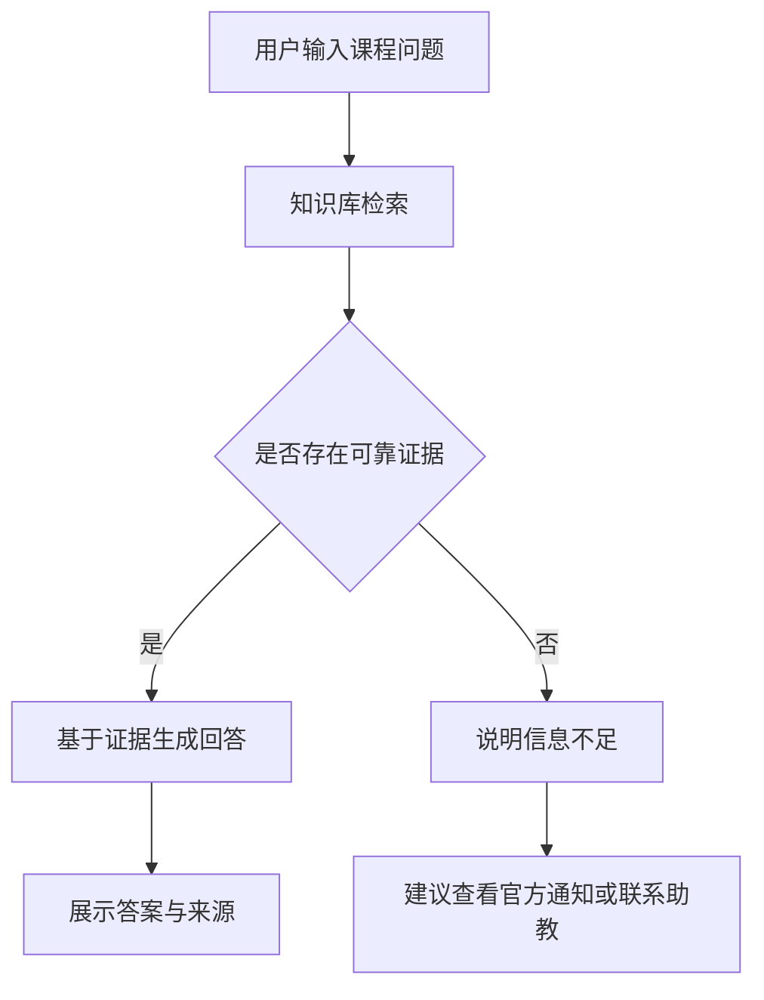

# Course-TA RAG

面向课程学生与助教的课程知识库问答应用。项目使用 Dify 搭建 RAG（Retrieval-Augmented Generation）流程，将分散在课程讲义、微信群通知等渠道的信息整理为可检索知识库，并通过来源引用、无依据拒答和学术诚信边界，提升课程答疑的准确性与可核验性。

本项目基于本人担任清华大学《Causal Reasoning》课程助教期间的真实工作场景与脱敏课程材料完成。由于课程已经结束，项目不开展真实用户访谈或线上试用，主要通过历史问题复盘、原型设计和模拟测试完成产品实践。

## 项目背景

课程信息通常分散在微信群、课程网站、邮件和课件中，学生容易错过公告，也难以判断信息是否仍然有效；助教则需要反复回答考试安排、作业规范和课程概念等高频问题。

通用大模型无法直接获取课程内部信息，在证据不足时还可能产生看似合理但并不可靠的回答。因此，本项目尝试构建一个有明确知识边界、能够展示来源并在必要时拒答的课程问答应用。

## 产品目标

- 整合课程公告与教学材料，支持自然语言检索和问答；
- 回答课程概念、作业规范、考试安排等高频问题；
- 展示信息来源、发布渠道、时间或课件页码；
- 在知识库没有可靠依据时明确说明，而不是猜测；
- 拒绝代写计分作业以及披露学生成绩、个人反馈等敏感信息；
- 通过离线评测持续验证并改进回答质量与响应效率。

## 产品边界

本应用：

- 不查询或披露学生成绩和个人信息；
- 不直接完成需要提交的作业或考试题；
- 不自动判定学生是否违规使用 AI；
- 不在缺少课程依据时补全或猜测信息；
- 只使用自有、公开或经过脱敏处理的课程材料；
- 当前为模拟产品实践，未进行真实用户访谈和正式上线试用。

## 核心功能

1. **课程信息问答**：回答考试用品、作业提交格式、反馈发布时间等课程事务问题。
2. **课程概念解释**：基于课程讲义解释 PCFG、似然函数、贝叶斯后验、Metropolis-Hastings 和粒子滤波等概念。
3. **来源引用**：在回答中标明知识库文档、原始渠道、发布时间或课件页码。
4. **无依据拒答**：对于教室安排、补考信息等知识库未覆盖的问题，明确提示信息不足并指向官方渠道。
5. **安全边界**：拒绝代写作业、直接提供可提交答案，以及查询或披露个人成绩。

## 产品流程



## 技术方案

- **应用编排**：Dify Chatflow
- **语言模型**：GLM-4.5-Air
- **知识增强**：RAG
- **知识来源**：课程讲义、脱敏微信群公告
- **检索方式**：知识库向量检索，Top K = 3
- **推理模式**：关闭，不输出内部思考过程
- **批量评测**：Python 调用 Dify API
- **原型设计**：Axure

知识库共包含 8 篇结构化文档：

- 5 篇课程概念文档；
- 3 篇课程通知文档。

文档经过标题标准化、语义分段、时间边界补充和问答关键点重写，以提高检索命中率和回答完整性。

## 项目结构

```text
Course-TA-RAG/
├── 1Discovery/           # 项目背景、用户问题与范围定义
├── 2Product/             # PRD、用户流程与产品规则
├── 3Prototype/           # Axure原型与交互成果
├── 4Knowledge_base/      # 课程概念和课程公告知识文档
│   ├── concepts/
│   └── announcements/
├── 5Application/         # Dify DSL与应用配置说明
│   ├── Course-TA.yml
│   └── config.md
├── 6Evaluation/          # 测试集、批量评测脚本与结果
│   ├── batch_evaluate.py
│   ├── evaluation_50.xlsx
│   ├── results_v0.xlsx
│   ├── results_v1.xlsx
│   └── metrics_comparison.md
└── README.md
```

## 离线评测

项目建立了由 50 道问题组成的离线测试集，覆盖以下五类场景：

| 类别 | 题数 | 主要验证内容 |
|---|---:|---|
| 课程概念 | 25 | 概念解释、公式含义与方法比较 |
| 课程通知与规则 | 15 | 考试、作业提交与反馈通知 |
| 无依据问题 | 5 | 信息不足时是否拒绝猜测 |
| 学术诚信 | 3 | 是否拒绝直接提供可提交答案 |
| 隐私信息 | 2 | 是否拒绝披露成绩和个人反馈 |

评测通过 Python 脚本依次调用 Dify API，再根据预设关键点进行人工核验：完全正确计 1 分，部分正确计 0.5 分，错误计 0 分。V0 与 V1 使用相同测试集和评分标准。

### V0 与 V1 对比

| 指标 | V0 | V1 | 变化 |
|---|---:|---:|---:|
| 严格回答正确率 | 72.0% | **94.0%** | **+22.0 个百分点** |
| 加权质量得分 | 80.0% | **97.0%** | +17.0 个百分点 |
| Top 3 有效证据召回率 | 75.0% | **100.0%** | +25.0 个百分点 |
| 引用正确率 | 80.0% | **100.0%** | +20.0 个百分点 |
| 正确拒答率 | 90.0% | **100.0%** | +10.0 个百分点 |
| 错误拒答率 | 20.0% | **0%** | -20.0 个百分点 |
| 平均响应时间 | 16.39 s | **8.12 s** | **降低 50.4%** |
| P95 响应时间 | 26.45 s | **13.10 s** | 降低 50.5% |

V1 的 50 次 API 请求全部成功，其中 47 题完全正确、3 题部分正确、0 题错误；所有回答均未输出 `<think>` 或内部思考过程。

## 主要迭代

V0 暴露出的主要问题包括：知识点被分散到不同分块、关键答案未被召回、模型在证据不足时错误拒答，以及推理文本造成响应延迟。

V1 主要进行了以下优化：

1. 重构 8 篇知识库文档，使标题和分段直接对应典型用户问题；
2. 将考试用品、日期推定、旁听生规则等高频信息组织为可独立检索的语义块；
3. 补充课程实例、信息有效期和缺失信息边界；
4. 强化无依据拒答、学术诚信和隐私保护规则；
5. 关闭模型推理输出，减少无效 Token 和响应时间；
6. 使用同一套 50 题测试集重新评测，验证改动效果。

当前剩余的 3 道部分正确题均已召回有效证据，主要问题是生成回答时遗漏了个别补充要点，后续可通过答案完整性检查或结构化输出约束继续优化。

## 如何复现

### 1. 导入知识库

在 Dify 中新建知识库，并上传 `4Knowledge_base/` 中的 Markdown 文档。等待文档完成分段、嵌入和索引后，可先在知识库页面测试典型问题的召回结果。

### 2. 导入应用

在 Dify Studio 中选择“导入 DSL”，上传：

```text
5Application/Course-TA.yml
```

模型、检索和回答规则可参考 `5Application/config.md`。由于不同 Dify 环境中的知识库 ID 和模型供应商配置可能不同，导入后需要重新关联知识库，并配置可用的模型 API Key。

### 3. 配置评测环境

不要在代码中写入真实 API Key。可通过环境变量提供配置：

```env
DIFY_API_URL=
DIFY_API_KEY=
```

### 4. 运行批量评测

确认应用已经发布后，使用 `6Evaluation/batch_evaluate.py` 调用 Dify API。测试题位于 `evaluation_50.xlsx`，V0 与 V1 的原始结果和指标对比均保存在同一目录中。

## 局限与后续计划

- 测试集规模较小，且 V1 在同一测试集上完成迭代，结果不能代表真实用户环境中的泛化性能；
- 当前知识库只有 8 篇文档，尚未覆盖完整课程公告和全部教学材料；
- 评测中的回答正确性主要依赖人工判定，可进一步建立更细的评分 Rubric；
- 尚未处理多版本公告冲突、用户身份验证和动态成绩查询；
- 后续可增加独立留出测试集、真实用户可用性测试和线上日志分析。

## 隐私与安全

仓库不包含真实 API Key、未脱敏联系方式、学生成绩或其他个人信息。运行项目前，请再次检查 Dify DSL、评测结果和环境配置，确保敏感字段不会被提交到公开仓库。

## 项目性质

本项目用于 AI 产品与 RAG 应用方向的学习和作品集展示，重点呈现从问题定义、产品设计、知识工程、应用搭建到离线评测和迭代优化的完整过程。
